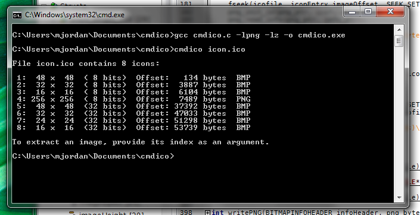

### cmdico
`cmdico` is a cross-platform command line utility for Windows Icon (.ico) files.
Icons can be *written* from one or more image files, and image files can be *extracted* from icon files.

### Dependencies
`cmdico` requires the following libraries:
* [libpng](https://github.com/glennrp/libpng)
* [zlib](https://github.com/glennrp/zlib)

### Building
`cmdico` can be compiled with the following command, using `gcc` as an example:

`gcc cmdico.c -lpng -lz -o cmdico.exe`

